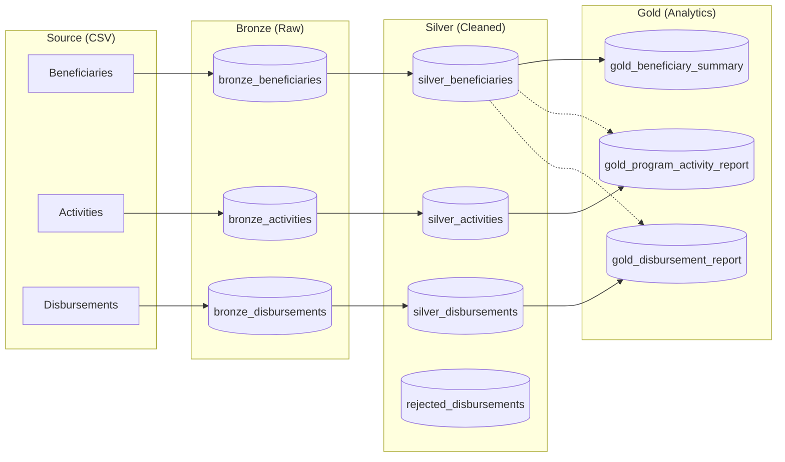

# Humanitarian Data Pipeline Demo

This project demonstrates a professional ELT (Extract, Load, Transform) pipeline designed for a humanitarian NGO context (inspired by the IRC). It processes synthetic field program data through a layered "Medallion" architecture (Bronze, Silver, Gold) to produce clean, actionable analytical marts while maintaining rigorous data quality standards.

## Architecture

The pipeline follows the industry-standard Medallion architecture. For detailed schema and transformation logic for each layer, see the [models/](./models/) directory.

1.  **Bronze (Raw Layer):** Source of truth. Raw CSVs are ingested as-is into SQLite with an added `ingestion_timestamp`. [Learn more.](./models/bronze/README.md)
2.  **Silver (Cleaned Layer):** Data is deduplicated, standardized (e.g., gender, dates), and validated. Impossible values (like ages < 0) are nulled out, and unverified disbursements are moved to a `rejected` table. [Learn more.](./models/silver/README.md)
3.  **Gold (Curated Layer):** Business-level aggregates and analytical marts (e.g., beneficiary summaries, program activity reports). [Learn more.](./models/gold/README.md)



## How to Run

### 1. Prerequisites
- `Python 3.10+`
- `pip`

### 2. Setup
First, clone the repository and navigate into the project directory:
```bash
git clone https://github.com/stkisengese/data-pipeline-demo.git
cd data-pipeline-demo
```

Then, install the required dependencies:
```bash
pip install -r requirements.txt
```

### 3. Generate Data
Generate the synthetic humanitarian data with intentional quality issues:
```python
python scripts/generate_data.py
```

### 4. Run Pipeline
Execute the full ELT process:
```python
python pipeline/run_pipeline.py
```

## Data Quality & Validation

A core component of this pipeline is the `validate.py` module, which produces a `quality_report.txt` after each run. Key checks include:

- **Null Analysis:** Flags columns exceeding a 5% null threshold (e.g., vulnerability scores).
- **Referential Integrity:** Detects "orphan" activities or disbursements that don't match any registered beneficiary.
- **Outlier Detection:** Identifies disbursements exceeding 3 standard deviations from the mean (potential fraud or data entry errors).
- **Deduplication:** Tracks duplicate counts before the Silver layer merge.

### Sample Quality Report Output
```text
--- HUMANITARIAN DATA QUALITY REPORT ---
1. NULL VALUE ANALYSIS
 Table: Beneficiaries
  - gender: 86 nulls (16.70%) [FAIL (ALARM)]
  - vulnerability_score: 35 nulls (6.80%) [FAIL (ALARM)]
2. DUPLICATE RECORD ANALYSIS
 Table: Beneficiaries - Duplicates found: 15
3. REFERENTIAL INTEGRITY
 Orphan Activities (no beneficiary match): 12
4. OUTLIER DETECTION
 Disbursement Amount Outliers (>3 std dev): 8
  Top outlier value: $1,857.09
```

## 🛠️ Design Decisions

- **SQLite for Portability:** Chose SQLite to ensure the hiring manager can run the project locally without any cloud credentials or complex database setup.
- **Pandas for Transformations:** Used Pandas for flexible and readable data manipulation, replicating dbt-style modeling logic.
- **Modular Scripts:** Separated ingestion, validation, and transformation into distinct modules orchestrated by a central runner for better maintainability and testing.
- **Synthetic Data Injection:** Intentionally injected realistic errors (negative ages, future dates, orphan records) to demonstrate how the pipeline handles real-world data issues common in field operations.

## Future Improvements (Next Steps)

With more time, I would:
- **Implement dbt Core:** Migrate SQL transformations to dbt for better documentation, testing, and lineage.
- **Great Expectations:** Replace the custom validation framework with Great Expectations for more robust, scalable data profiling.
- **Airflow/Prefect:** Add an orchestration layer to handle retries and complex dependencies.
- **Cloud Integration:** Move source data to S3 and the data warehouse to Snowflake or BigQuery.

---
**License** [MIT License](/LICENSE) 
**Contact:** [Stephen Kisengese](github.com/stkisengese)
---
